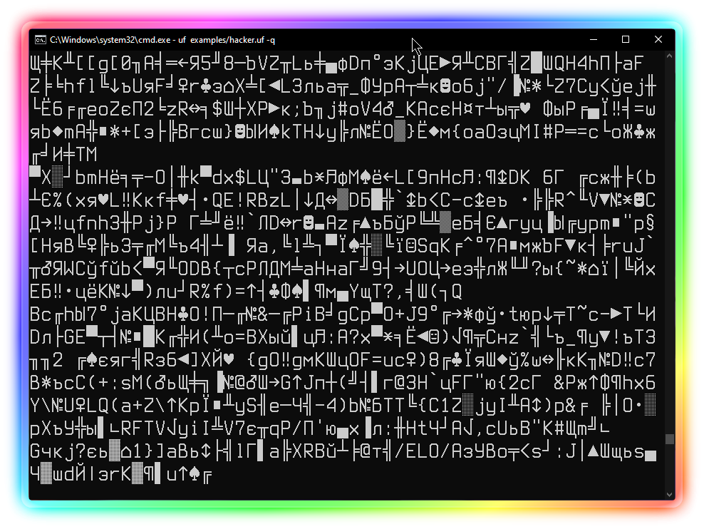

# Ultrafuck

### Yet another Brainfuck dialect. Brainfuck coding made more powerful. Ultra. Sample Text. WTF I am doing with my life...

**\[[English](README.md) / [Русский](README-RU.md)\]**

---

**Ultrafuck** is an esoteric programming language based on very famous Brainfuck programming language. Brainfuck is known for its minimalistic syntax and a few count of commands, while Ultrafuck is (not) known for its hardcore character.\
Actually, in Ultrafuck you have to execute the same Brainfuck commands (+ some extras Ultrafuck-only) by... executing another commands. It is like switching TV channels, is not it?

I do not know what the hell did I create **this**, but okay.

> Usage:\
> `ultrafuck <filename> [-c outfilename]` - execute Ultrafuck program OR convert Brainfuck to Ultrafuck code\
> `ultrafuck -v` - display version and exit

Let's see how to do coding in this wonderful programming language:

```
Ultrafuck commands:

>/<     Next/Previous BF command
!		Execute BF command
~		Null (reset BF command)
[]		Loop
{}		Endless Loop

BF commands:

1/2:    Next/Previous memory cell
3/4:	Increase/Decrease memory cell value
5:		Write memory cell value into console (as an ASCII character)
6:		Read memory cell value from keyboard (as an ASCII character)
7:		Set random memory cell value
8:		Write memory cell value into console (as number)
9:		Break (stop program execution)

***

Oh, and also Ultrafuck has COMMENTS!!! Life is PeRfEcT!!!! =)

***
```

I have been developing this garbage just for fun since April to August 2023. And... that's all I can say here. Ultrafuck is licensed under the terms of [The Unlicense](UNLICENSE.txt), and I am tired of writing this shit.


